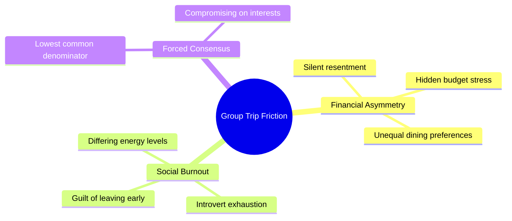
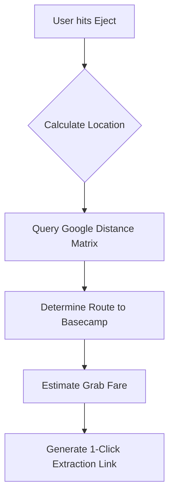
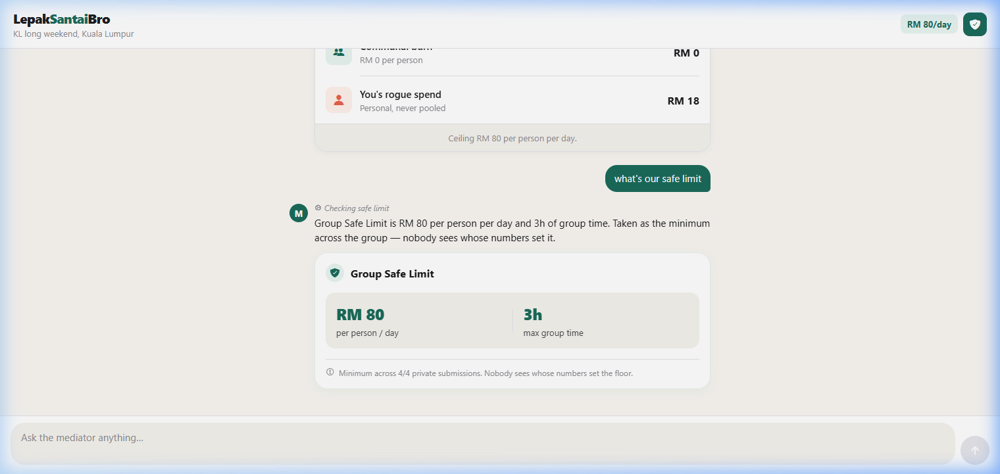
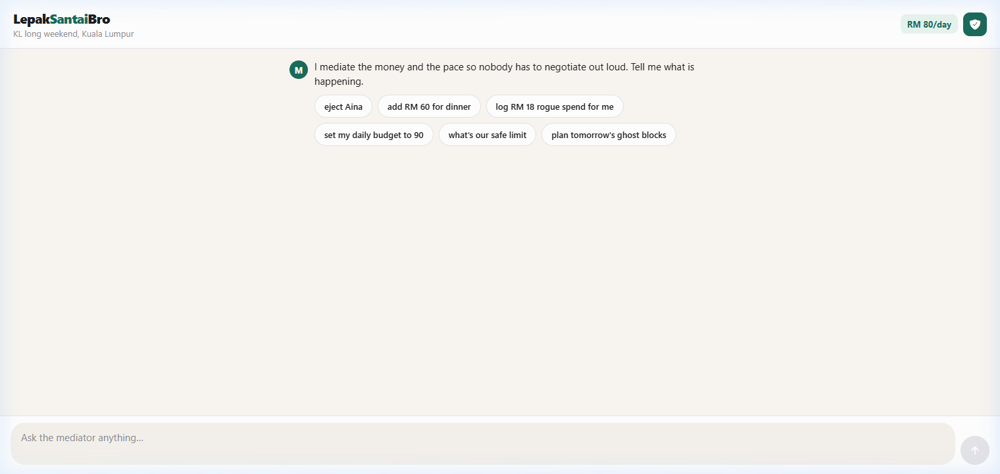
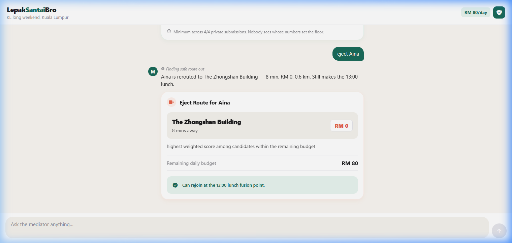
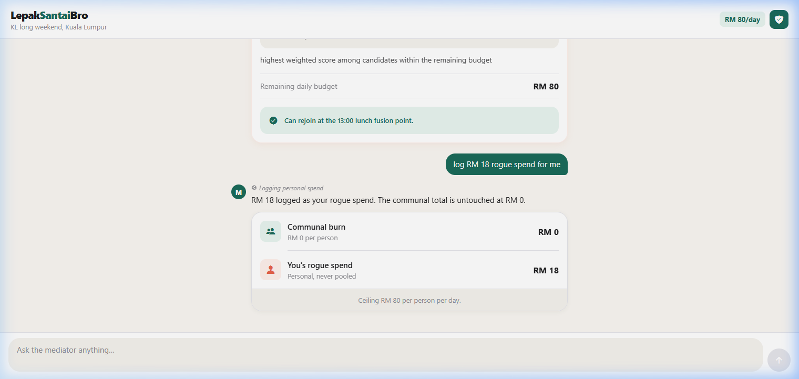
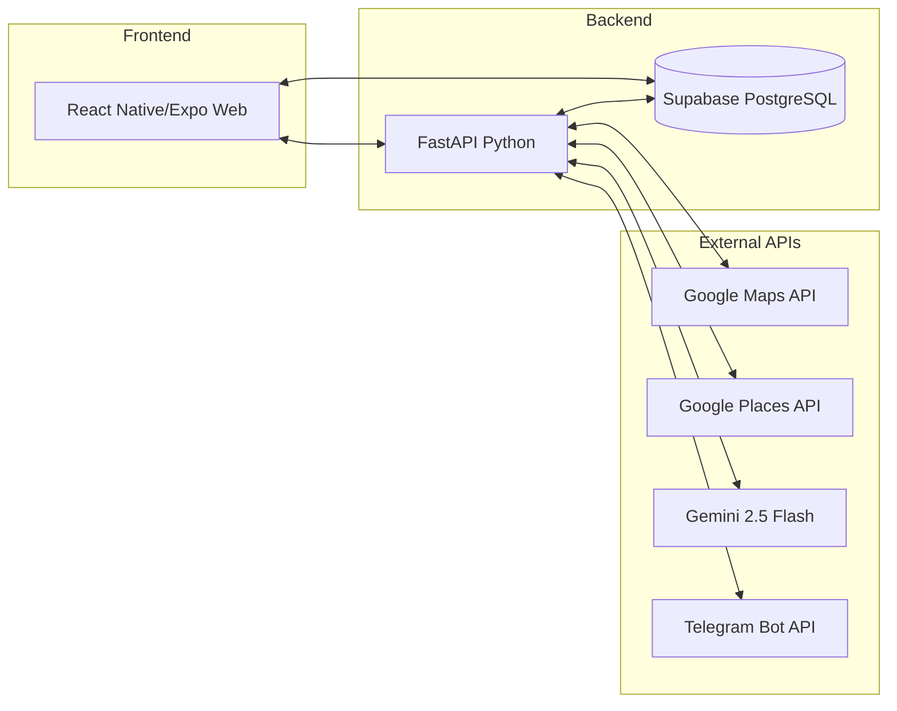

# Group Trip Mediator by Team LepakSantaiBro
**Team:** Vincent Chew, Vinish Suria

**Problem Statement:** Lifestyle Track - Planning an Escape (Travel Planner)

**Video Presentation:** [Watch on YouTube](https://youtu.be/pOFKrFlQyk4)

**Presentation Slides:** [View on Google Drive](https://drive.google.com/drive/folders/1K-cAZtNlipioQngB-ZMT2QAh5hgeltqE?usp=sharing)

---

## 1. Project Overview

### The Problem
Group trips are rarely ruined by bad locations; they are ruined by **financial asymmetry and social burnout**. Current market solutions like *Wanderlog* or *TripIt* act purely as geographic itinerary builders. They assume everyone in the group has the same budget and the same energy levels, forcing a "lowest common denominator" consensus. When one person suggests an expensive RM150 dinner, the rest silently stress about it to avoid conflict. When someone gets exhausted and wants to leave, they feel guilty for breaking up the group. Existing apps orchestrate the *places*, but completely ignore the *human friction* of traveling together.

### Our Solution
**Group Trip Mediator** is a ruthless social and financial mediator for group travel. Instead of forcing everyone to agree on a single path, it mathematically protects individual budgets and uses algorithmic pathfinding to seamlessly split, extract, and merge group members when things go wrong.

**Core Features:**
*   **Blind Budget Kill Switch:** Members privately submit their absolute maximum daily budget. The app calculates a hidden "Group Safe Limit" and hard-blocks the planner from adding communal activities that breach the lowest threshold. 
*   **Fission & Fusion Itinerary:** The timeline anchors the group for major events (e.g., Dinner), but injects "Ghost Blocks" where the group is deliberately fractured based on energy pace (Pacesetters go hiking; Spectators go to a cafe).
*   **The "Eject" Engine:** A 1-click panic button on the live itinerary for when a member burns out. It calculates the walking distance/Grab fare to "Basecamp" (Hotel) and provides a deep link to safely extract the user without requiring a group debate.
*   **Frictionless Telegram Onboarding:** Downloading a new app just for one trip is massive friction. Members simply click a deep link to our Telegram Bot (`/start`) to instantly authenticate and join the trip. The bot also serves as our "Opt-In Reconvene" system, pinging the squad 30 minutes before crucial "Fusion" events without the battery drain of background location tracking.
*   **RAG-Lite Anchor Suggestions:** An AI assistant grounded strictly by the Google Places API and the Group Safe Limit, guaranteeing accurate, budget-safe restaurant recommendations.

### How It Works (The User Journey)
1. **The Setup (Frictionless Entry):** A group of 4 friends decides on a trip. Instead of downloading a heavy app, the trip leader shares a Telegram deep link. The friends click it, instantly joining the trip via the Bot. During this blind onboarding, they each secretly input their maximum daily budget and social battery limit. 
2. **The Kill Switch:** The app calculates that the lowest budget in the group is RM100/day. This becomes the invisible "Group Safe Limit".
3. **The Conflict:** Friend A tries to schedule a RM150 Wagyu Dinner for the whole group. The app instantly blocks the addition because it breaches the RM100 limit, preventing a socially awkward confrontation where the poorest friend has to object.
4. **The Fission:** Instead of forcing everyone to agree, the app suggests a "Fission Block." It splits the group: Friend A and B go to the Wagyu Dinner, while Friend C and D are routed to a budget-safe RM30 cafe nearby. 
5. **The Fusion:** 30 minutes before they are scheduled to regroup at the hotel, the Telegram Bot automatically pings all 4 members with directions to rendezvous, seamlessly bringing the group back together.
6. **The Eject:** Later that night, Friend C's social battery dies. Instead of ruining the group's vibe by asking everyone to leave early, Friend C presses the **Eject** button. The app calculates the exact Grab fare back to the hotel and provides a 1-click link to order the ride and safely extract them.

---

## 2. Ideation & Process

### 2.1 Ideas We Considered

| Idea | Why it was dropped / kept |
| :--- | :--- |
| **Financial Asymmetry & Disaster Recovery (Chosen)** | **Kept.** Targets the highest source of real-world friction. Extremely high originality compared to standard planners. Highly feasible technical scope using deterministic routing and flat arrays. |
| **Energy-Based Planner (SyncPace)** | **Iterated.** Splitting by "high energy" vs "low energy" was a solid start, but lacked the provocative edge. We merged this into the final idea as "Ghost Blocks" but realized financial friction was a much stronger hook for the judges. |
| **Collaborative Map & Upvoting (Wanderlog Clone)** | **Dropped.** The most predictable response to the prompt. Judges have seen this 100 times. Does not solve the anxiety of speaking up against expensive plans. |
| **Generative AI 3-Day Itinerary Builder** | **Dropped.** Stochastic parrots (LLMs) hallucinate closed restaurants and wrong prices. It's technically weak and impossible to trust in a foreign city. |

### 2.2 Ideation Boards

*We realized early on that tracking every single cent ("Rogue Spend") was a mass surveillance liability. We pivoted to a simpler "Kill Switch" to protect privacy while still solving the budget problem.*

*Our initial mindmap exploring the root causes of group trip arguments, leading us away from geography and toward psychology.*

*The flow chart of our "Proxy Eject" engine, ensuring we don't rely on expensive Google API routing, prioritizing user safety by routing straight to Basecamp.*

### 2.3 Mentor Consultation

| Date | Feedback Received | What Was Changed |
| :--- | :--- | :--- |
| 31 August 2026 | Continuous background location tracking drains battery and violates PDPA/Privacy. | **Massive Pivot.** Dropped background tracking completely. Swapped to an "Opt-In Reconvene" system using Telegram push notifications 30-mins before an event. |
| 31 August 2026 | Relying purely on Gemini to suggest budget restaurants will result in hallucinations. | **Architecture Change.** Implemented a RAG-Lite system. We now query Google Places API *first*, then feed that real data into Gemini to filter by the budget. |
| 31 August 2026 | Complex parallel branching in the UI timeline will cause React state-management hell. | **Scoping Down.** Flattened the database schema. Fission events are now just side-by-side cards in a linear 1D array. |

---

## 3. Design & Prototype

**UI Prototype:** This GitHub Repository (Run locally via Expo Web)

*(Here are screenshots of our final responsive UI running on Expo Web)*

**1. Blind Threshold Onboarding:** Users privately lock in their social battery and absolute budget limits. The app displays the lowest common limit to protect everyone.

**2. The Fission Prompt:** The planner attempts to add a RM150 activity. The Kill Switch blocks it and forces the group to split into "Ghost Blocks" (Fission).

**3. The Eject Engine:** A user hits their limit. The proxy engine calculates Grab costs and provides a safe extraction route.

**4. Communal Ledger:** The itinerary planner tracks what is a shared "Communal Burn" versus private "Rogue Spend", keeping the finances perfectly separated.

---

## 4. What Makes It Different

*   **Anti-Consensus Philosophy (Novel Twist):** While other apps force the group to vote and agree on everything, our app acts as the bad guy. It actively fractures the group during "Ghost Blocks" to save social batteries, acknowledging that forced consensus ruins trips.
*   **The Eject Engine (Novel Feature):** We went beyond planning and tackled *disaster recovery*. The ability to mathematically extract a member from an itinerary with a deterministic Grab cost estimate is entirely original for a travel app.
*   **Blind Group Safe Limit (Differentiation):** Unlike Splitwise (which tracks debt *after* you overspend), our app prevents budget breaches *before* they happen by aggregating a hidden floor limit that the planner cannot violate.

### Comparison to Existing Solutions

| Feature | Group Trip Mediator | Wanderlog | Splitwise |
| :--- | :--- | :--- | :--- |
| **Focus** | Human Friction & Compromise | Map Geography | Retroactive Debt |
| **Pacing Splits** | Yes (Ghost Blocks) | No (Rigid) | N/A |
| **Budget Control** | Proactive (Kill Switch) | Manual Tracking | Retroactive |
| **Burnout Recovery** | Yes (Proxy Eject) | None | N/A |

---

## 5. Technical Architecture & Feasibility

### Tech Stack
*   **Frontend: React Native (Expo).** Chosen for rapid cross-platform deployment. A custom dev client allows us to compile native modules easily.
*   **Backend: FastAPI (Python).** Chosen for its speed in writing deterministic mathematical engines (calculating the heuristic Grab prices and Group Safe Limits).
*   **Database: Supabase (PostgreSQL).** Chosen for real-time synchronization of the Fission itinerary across all group members' devices, avoiding the need to manually build WebSockets.
*   **Communication: Telegram Bot API.** Chosen to bypass the strict opt-in rules of iOS Web Push notifications (FCM). It guarantees instant delivery for our "Opt-In Reconvene" pings.
*   **APIs: Google Maps Distance Matrix & Places API.** Used strictly as proxies to ground our data. Distance Matrix calculates safe extraction times, and Places API feeds accurate data into our RAG-Lite engine.
*   **AI: Gemini 2.5 Flash.** Used purely as a reasoning engine to filter real-world Places data against strict JSON budgets.
*   **Hosting:** We chose **Render** for our FastAPI backend due to native Python support, and **Vercel** for the React Native Web build. *Constraint:* Because webhooks can't ping localhost during development, we built a custom Long Polling Python script to bridge Telegram's API directly to our local FastAPI server without needing ngrok.

### System Architecture Diagram

### Build Plan & Scope
To ensure this was feasible in 48 hours, we aggressively scoped down liabilities:
1.  **No Graph Pathfinding:** We dropped complex A* routing for the Eject engine. We route *only* to a static "Basecamp", reducing API calls from dozens to exactly one.
2.  **No Continuous Tracking:** We dropped background geolocation. The app only requests location exactly when the user hits "Eject".
3.  **Flat Array Ledger:** We dropped complex individual "Rogue Spend" tracking. The ledger only tracks communal events in a flat chronological array, making Supabase reads incredibly fast and bug-free.

---

## 6. Future Scalability & Impact
While built for small friend groups, this architecture has a clear path to wider impact:
*   **B2B Corporate Retreats:** The "Kill Switch" and "Eject" mechanics are perfectly suited for HR departments managing corporate offsites, where employee energy levels and company budgets must be strictly balanced.
*   **API Monetization:** The core logic of the "Proxy Eject Engine" can be packaged as an SDK for existing booking platforms (like Agoda or Klook) to offer "Burnout Protection" routing to their users.
